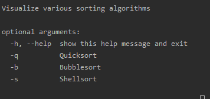

# VisualSort
Common sorting algorithms visualized using pygame.

This is just a quick and dirty implementation with further optimizations and algorithms to be added soon.

GIF bubblesort example

**Support for command line arguments to choose which algorithm to visualize**

